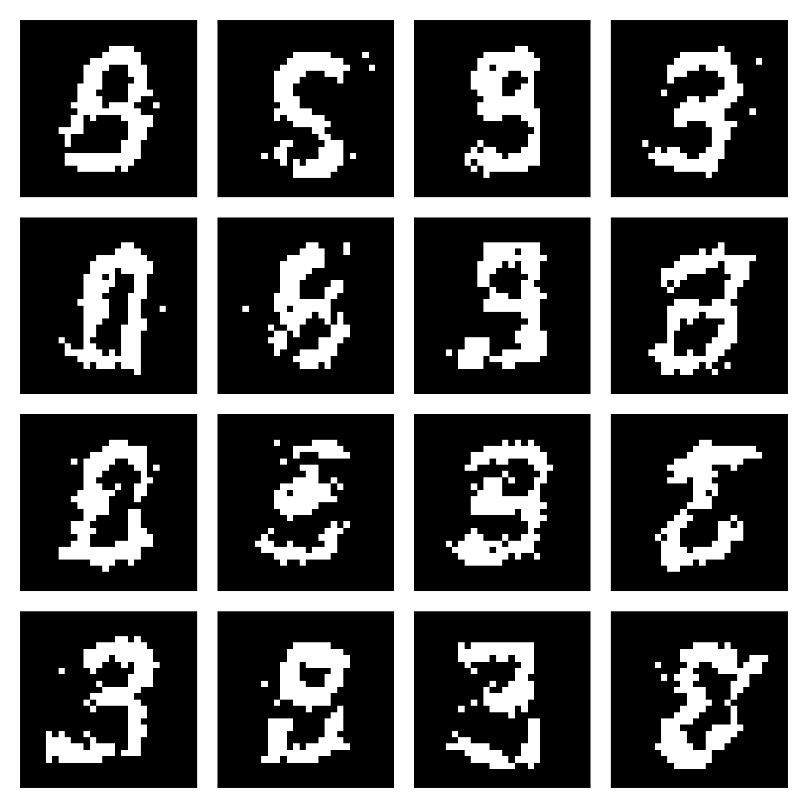
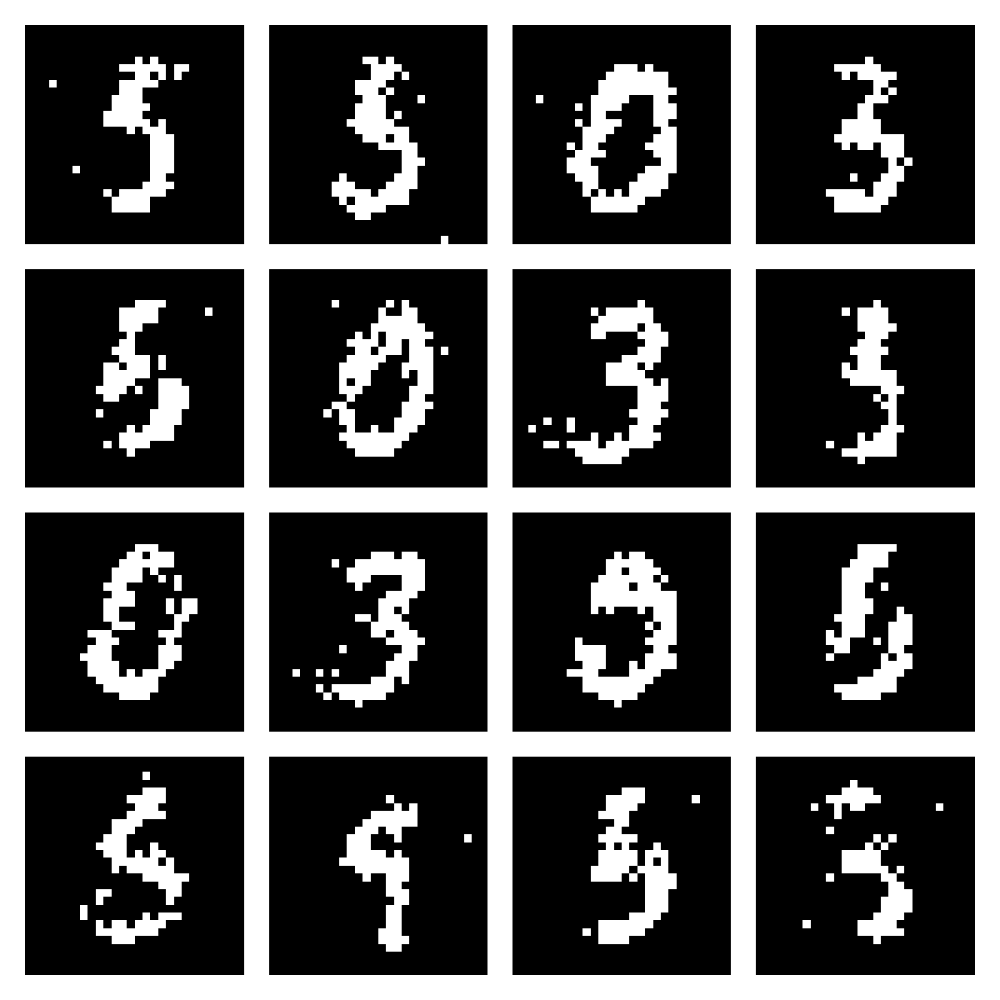

# Boltzmann Machine

PyTorch implementations of binary Boltzmann Machine and Restricted Boltzmann Machine (RBM) generative models for MNIST.

## Models

- `BoltzmannMachine`: A fully connected model in which every unit is connected to every other unit
- `RestrictedBoltzmannMachine`: An RBM with 784 visible units and 256 hidden units, with connections only between the visible and hidden layers

Both models are trained using PCD-1. MNIST images are flattened into 784-dimensional vectors and binarized at a pixel-value threshold of `0.5`. The fully connected model consists of 784 units.

## Setup

```bash
uv sync
```

## Train

Fully connected Boltzmann Machine:

```bash
uv run python scripts/train_bm.py
```

Restricted Boltzmann Machine:

```bash
uv run python scripts/train_rbm.py
```

Trained checkpoints are saved to `checkpoints/`.

Both models use the same training configuration:

- Training data: 5,000 MNIST images
- Batch size: 128
- Epochs: 50
- Learning rate: `0.05`
- Gibbs sweep: 1
- Random seed: `42`
- Weight clipping: `[-1, 1]`

## Generate

```bash
uv run python scripts/generate_bm.py
uv run python scripts/generate_rbm.py
```

Generated images are saved to `outputs/`.

## Generated Samples

### Boltzmann Machine



### Restricted Boltzmann Machine



## Development

Linting and formatting with Ruff:

```bash
uv run ruff check . --fix
uv run ruff format .
```

## License

This project is licensed under the [MIT License](LICENSE).
